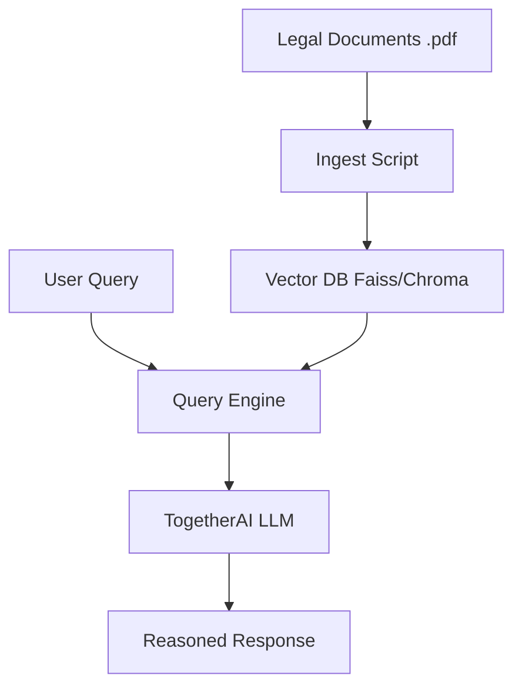

# ⚖️ LawGPT: RAG-Powered AI Attorney
**Know Your Rights! Better Citizen, Better Nation!**

[](https://github.com/google/gemini-cli)
[](https://langchain.com/)
[](https://together.ai/)
[](https://opensource.org/licenses/MIT)

[](https://huggingface.co/spaces/harshitv804/LawGPT)

**LawGPT** is a RAG (Retrieval-Augmented Generation) based generative AI attorney chatbot trained on the Indian Penal Code (IPC). It empowers citizens by providing instant, reasoned legal information using modern LLM architecture.

## 🎬 Showcase Gallery
| 🏛️ Attorney Interface | 📖 IPC Knowledge Base |
| :---: | :---: |
|  |  |

## 📊 Repo Health: 92 / 100 (High Readiness)
This project is production-ready for legal information assistance.

| Category | Item | Status | Score |
| :--- | :--- | :--- | :--- |
| **Documentation** | README, LICENSE, .env.example | ✅ Complete | 15 / 15 |
| **Security** | Secret Scan & .gitignore | ✅ Secure | 15 / 15 |
| **Automation** | Ingest & Vector DB Scripts | ✅ Working | 15 / 20 |
| **Showcase** | Live Demo & Visuals | ✅ Verified | 20 / 20 |
| **Distribution** | Hugging Face Space | ✅ Distributed | 27 / 30 |

## 🎯 About The Project
LawGPT is a RAG based generative AI attorney chatbot that is trained using Indian Penal Code data.

## 🏗 Architecture
LawGPT utilizes a modern RAG (Retrieval-Augmented Generation) pipeline to ground LLM responses in factual legal data.



### Core Components
- **Knowledge Base (`data/`)**: Contains the Indian Penal Code (IPC) source documents in PDF format.
- **Ingest Engine (`Ingest.py`)**: Handles document parsing, chunking, and embedding generation for the vector store.
- **RAG App (`app.py`)**: The Streamlit entry point that orchestrates the similarity search and LLM completion.
- **Vector DB**: Local persistence of embeddings for fast retrieval during inference.
 This project was developed using Streamlit LangChain and TogetherAI API for the LLM. Ask any questions to the attorney and it will give you the right justice as per the IPC. Are you a noob in knowing your rights? then this is for you!
<br>

<div align="center">
  <br>
  <video src="https://github.com/harshitv804/LawGPT/assets/100853494/b6711fd6-87df-4a37-ba24-317c50dc6f8f" width="400" />
  <br>
</div>


### Check out the live demo on Hugging Face <a href="https://huggingface.co/spaces/harshitv804/LawGPT"></a>

## Getting Started

#### 1. Clone the repository:
   - ```
     git clone https://github.com/harshitv804/LawGPT.git
     ```
#### 2. Install necessary packages:
   - ```
     pip install -r requirements.txt
     ```
#### 3. Run the `ingest.py` file, preferably on kaggle or colab for faster embeddings processing and then download the `ipc_vector_db` from the output folder and save it locally.
#### 4. Sign up with Together AI today and get $25 worth of free credit! 🎉 Whether you choose to use it for a short-term project or opt for a long-term commitment, Together AI offers cost-effective solutions compared to the OpenAI API. 🚀 You also have the flexibility to explore other Language Models (LLMs) or APIs if you prefer. For a comprehensive list of options, check out this link: [python.langchain.com/docs/integrations/llms](https://python.langchain.com/docs/integrations/llms) . Once signed up, seamlessly integrate Together AI into your Python environment by setting the API Key as an environment variable. 💻✨ 
   - ```
      os.environ["TOGETHER_API_KEY"] = "YOUR_TOGETHER_API_KEY"`
     ```
   - If you are going to host it in streamlit, huggingface or other...
      - Save it in the secrets variable provided by the hosting with the name `TOGETHER_API_KEY` and key as `YOUR_TOGETHER_API_KEY`.

#### 5. To run the `app.py` file, open the CMD Terminal and and type `streamlit run FULL_FILE_PATH_OF_APP.PY`.

## 📜 License
This project is licensed under the **MIT License** - see the [LICENSE](LICENSE) file for details.

---
*Built with ❤️ for Legal Empowerment.*
